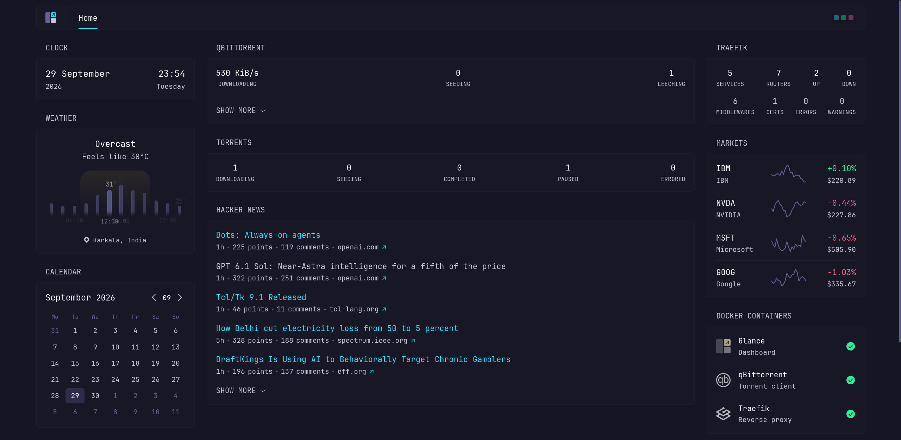

# minipc

A small rootless Podman + Quadlet stack behind Traefik, reachable over Tailscale
only. Apps live in `apps/<name>/` (a `.container` unit plus an optional
`setup.sh`); `scripts/stack.sh` deploys them as systemd user services.

<!-- Replace with a real screenshot: docs/glance.png -->


## Prerequisites

- Podman
- Tailscale up, with HTTPS enabled for the tailnet
  (`sudo tailscale set --operator=$USER`)
- `jq`, and `net.ipv4.ip_unprivileged_port_start=80` for rootless `:80`/`:443`

## Setup

```sh
scripts/bootstrap.sh        # repo skeleton, linger, podman socket, firewall
cp .env.sample .env         # fill in the keys you need (keep it empty for now)
scripts/stack.sh install    # run app setups, link units, start everything
scripts/stack.sh check      # verify prerequisites, setup and installed state
```

## Management

```sh
scripts/stack.sh status [app]         # unit/container state, routers, probes
scripts/stack.sh logs [unit]          # follow the journal
scripts/stack.sh restart [app|unit]
scripts/stack.sh stop [app]
scripts/stack.sh setup [app]          # re-run an app's pre-install steps
scripts/stack.sh uninstall [app] [--purge]
```

Traefik terminates TLS and routes by path; its dashboard is at `/traefik/`, the
Glance dashboard at `/`. The tailnet name is detected from Tailscale, not
hardcoded.
